<div align="center">

# Bayesian Bike Sharing

### A complete Bayesian workflow for daily bike-sharing demand on the UCI Bike Sharing dataset

[](https://www.python.org/downloads/)
[](https://www.pymc.io/)
[](https://opensource.org/licenses/MIT)
[](https://www.qmul.ac.uk/)

*Likelihood justification → Weakly informative priors → NUTS posterior inference → Convergence diagnostics → Prior sensitivity → Sequential Bayesian updating*

</div>

---

## Overview

We model daily bike rental demand as a function of normalised **temperature** and **humidity** using a Bayesian linear regression with a Gaussian likelihood. The full posterior over $(\beta_0, \beta_1, \beta_2, \sigma)$ is obtained via NUTS in [PyMC 5](https://www.pymc.io/), benchmarked against an OLS baseline, stress-tested against three prior specifications, and finally extended with **sequential Bayesian updating** across four chronological data blocks.

The dataset is the UCI [Bike Sharing Dataset](https://archive.ics.uci.edu/dataset/275/bike+sharing+dataset) ([Fanaee-T & Gama, 2014](https://doi.org/10.1007/s13748-013-0040-3)). We work with a fixed-seed subsample of $n = 360$ daily records to keep the analysis reproducible while leaving room for a clean four-way temporal split.

<div align="center">

| Variable | Mean | SD | Min | Median | Max |
|:---:|:---:|:---:|:---:|:---:|:---:|
| `cnt` (daily rentals) | 4392.11 | 1935.64 | 22 | 4336.5 | 8555 |
| `temp` (normalised) | 0.486 | 0.182 | 0.097 | 0.476 | 0.849 |
| `hum` (normalised) | 0.615 | 0.145 | 0.000 | 0.608 | 0.973 |

</div>

---

## Highlights

- **Likelihood justification grounded in the variance decomposition.** Equidispersion is rejected at the *conditional* level (omitted seasonal/working-day covariates inflate $\mathrm{Var}(y \mid x)$ across days), not from the marginal var/mean ratio alone — a subtler argument than the usual "ratio ≫ 1, drop Poisson" reflex.
- **Gaussian likelihood justified by CLT plus boundary distance**, with the heteroscedastic $\mathcal{N}(\mu_i, \mu_i)$ shape softened to a homoscedastic $\sigma^2$ as a deliberate, documented modelling choice.
- **Prior elicitation tied to the empirical scale of the response**, not pulled from thin air: the $\sigma_\beta = 10000$ width covers $7\times$ the empirical range of `cnt`, while the Half-Normal scale of 3000 places the prior median (~2024) close to the empirical SD (~1936).
- **Three-prior sensitivity analysis** (weakly informative, very diffuse, narrow stress-test) quantifies prior dominance via standardised shifts $\Delta / \mathrm{SD}_\text{post}$.
- **Sequential Bayesian updating extension** treats each block's posterior as the next block's prior via moment matching, exposing genuine seasonal heterogeneity in the humidity coefficient that the full-sample posterior averages out.

---

## Pipeline

```
Raw day.csv (731 obs)
        │
        ▼
┌──────────────────┐
│  data_prep.py    │   seed=42, n=360, sorted by date
└──────────────────┘
        │
        ▼
┌──────────────────┐
│  eda.py          │   summary stats, scatter, correlation, var/mean
└──────────────────┘
        │
        ▼
┌──────────────────────┐    ┌──────────────────────┐
│ frequentist_baseline │    │ model_pymc           │  NUTS, 4 chains × 2000
│ (OLS reference)      │    │  + posterior_summary │  warmup 1000, target 0.95
└──────────────────────┘    └──────────────────────┘
                                    │
                                    ▼
                            ┌──────────────────┐
                            │ diagnostics.py   │   trace, R̂, rank, ESS, autocorr
                            └──────────────────┘
                                    │
                                    ▼
                            ┌──────────────────┐
                            │ sensitivity.py   │   Priors A / B / C
                            └──────────────────┘
                                    │
                                    ▼
                            ┌──────────────────────┐
                            │ sequential_update.py │   4 blocks × moment-matched prior
                            └──────────────────────┘
```

---

## Model specification

$$
\begin{aligned}
\beta_0,\beta_1,\beta_2 &\overset{\text{iid}}{\sim} \mathcal{N}(0, 10000^2)\\
\sigma &\sim \mathrm{Half\text{-}Normal}(3000)\\
\mu_i &= \beta_0 + \beta_1\,\mathrm{temp}_i + \beta_2\,\mathrm{hum}_i\\
\mathrm{cnt}_i \mid \mu_i, \sigma &\sim \mathcal{N}(\mu_i,\, \sigma^2),\quad i = 1,\dots,360
\end{aligned}
$$

**Why these priors are weakly informative.** The 95% prior interval $(-19{,}600,\, 19{,}600)$ for each $\beta_j$ comfortably envelops the OLS point estimates ($\hat\beta_1 \approx 6796$, $\hat\beta_2 \approx -2370$) while ruling out values that would imply an effect exceeding the entire empirical range of `cnt`. The Half-Normal scale of 3000 places its median ($\approx 2024$) close to the empirical SD of `cnt` ($\approx 1936$).

### Prior predictive check

<div align="center">
  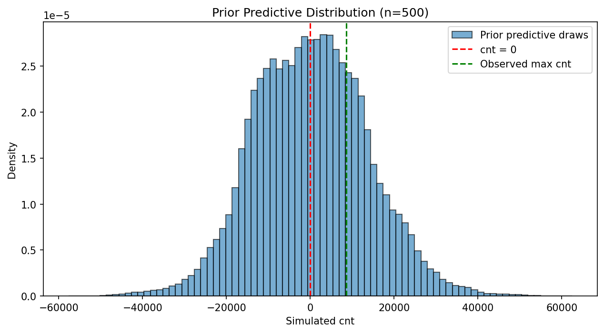
  <br/>
  <em>500 prior predictive draws span ±30,000, roughly 7× the empirical range of cnt. Wide enough to avoid pre-determining the response; structured enough to exclude implausibly diffuse models.</em>
</div>

---

## Exploratory data analysis

<div align="center">
  <table>
    <tr>
      <td>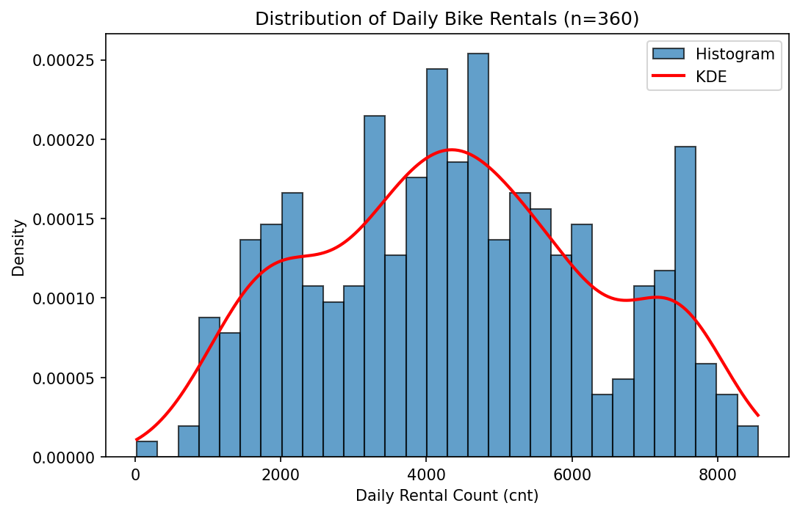</td>
      <td>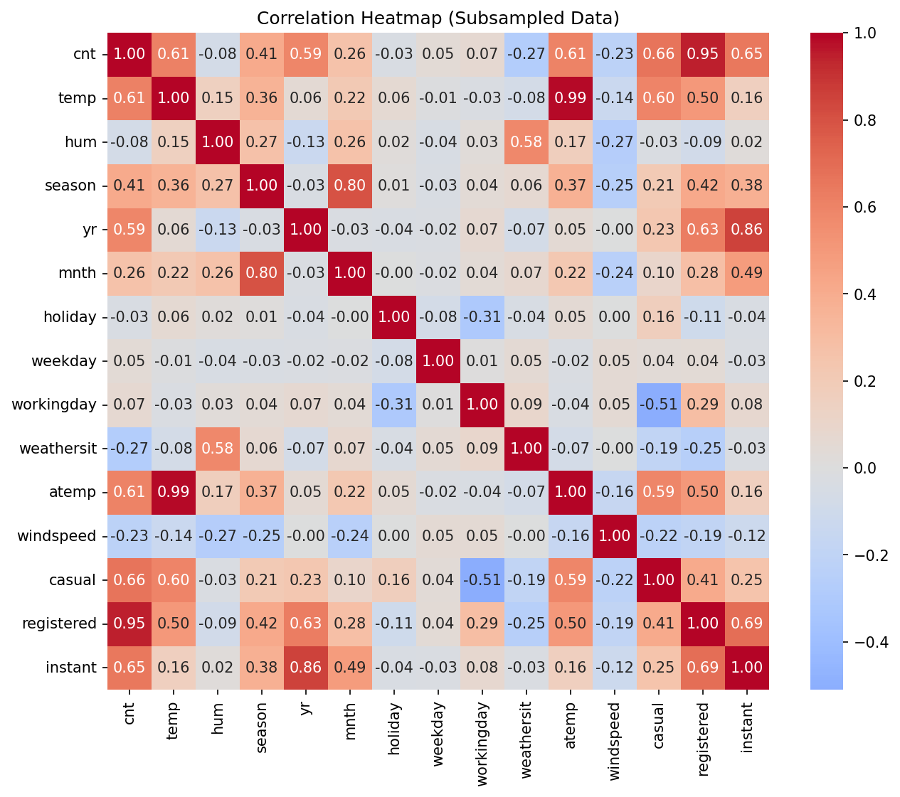</td>
    </tr>
    <tr>
      <td>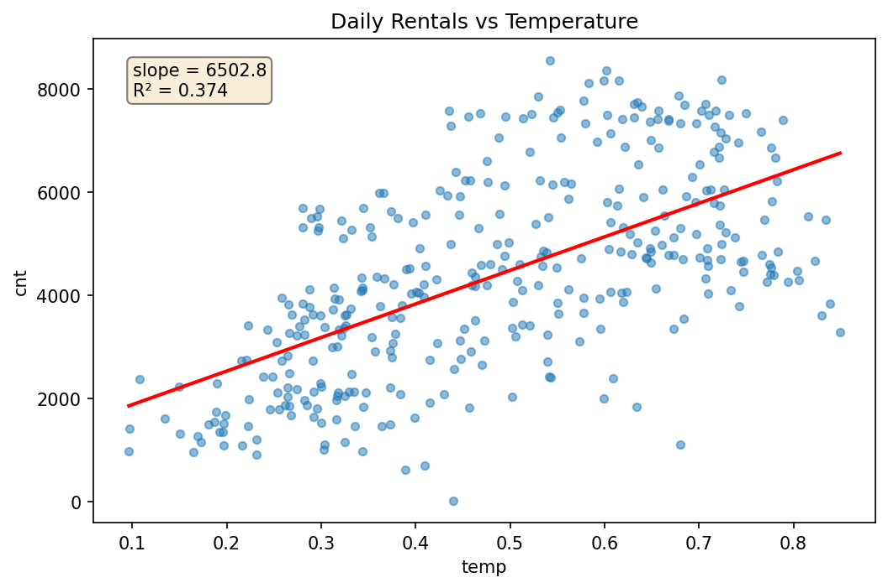</td>
      <td>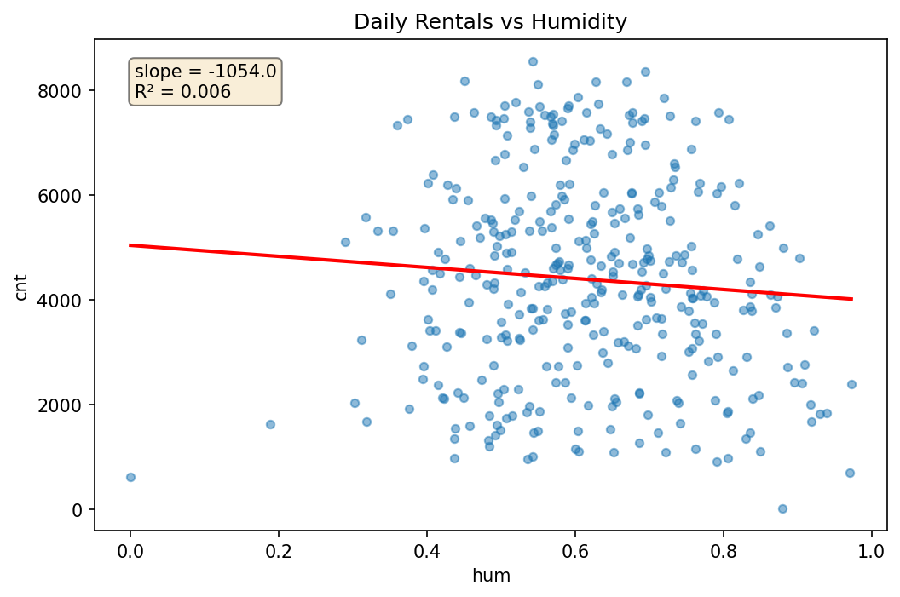</td>
    </tr>
  </table>
</div>

Temperature dominates the linear structure (Pearson $r = 0.612$). The marginal humidity correlation of $-0.079$ is misleading: once temperature is conditioned on, humidity's *partial* effect emerges as credibly negative (see posterior summaries below).

---

## Posterior inference (NUTS)

Sampler: **NUTS** in PyMC 5, 4 chains × 2000 retained draws after 1000 warm-up steps, target acceptance 0.95, seed 42. **No divergent transitions** were recorded.

<div align="center">

| Parameter | Mean | SD | 95% HDI lower | 95% HDI upper | $\hat R$ | ESS<sub>bulk</sub> |
|:---:|---:|---:|---:|---:|:---:|---:|
| $\beta_0$ (intercept) | 2541 | 382 | 1799 | 3324 | 1.00 | 3 775 |
| $\beta_1$ (temp) | **6784** | 436 | 5915 | 7632 | 1.00 | 5 371 |
| $\beta_2$ (hum) | **−2350** | 555 | −3457 | −1276 | 1.00 | 4 181 |
| $\sigma$ | 1500 | 56 | 1393 | 1610 | 1.00 | 5 352 |

</div>

<div align="center">
  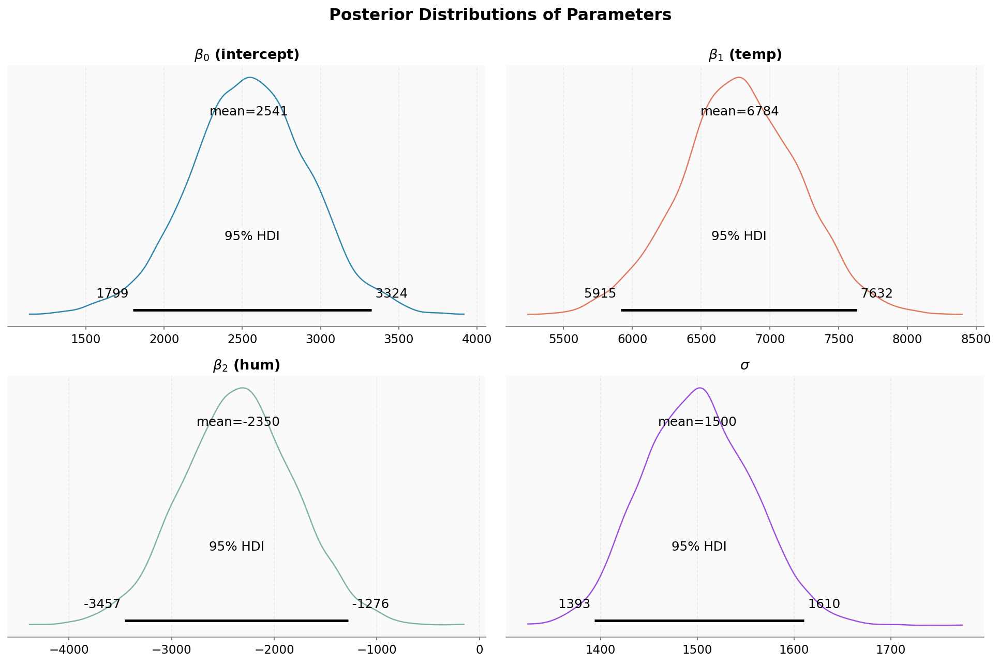
  <br/>
  <em>Marginal posterior densities. The 95% HDI for both β₁ and β₂ lies wholly on one side of zero, providing decisive evidence for non-zero temperature and humidity effects.</em>
</div>

<div align="center">
  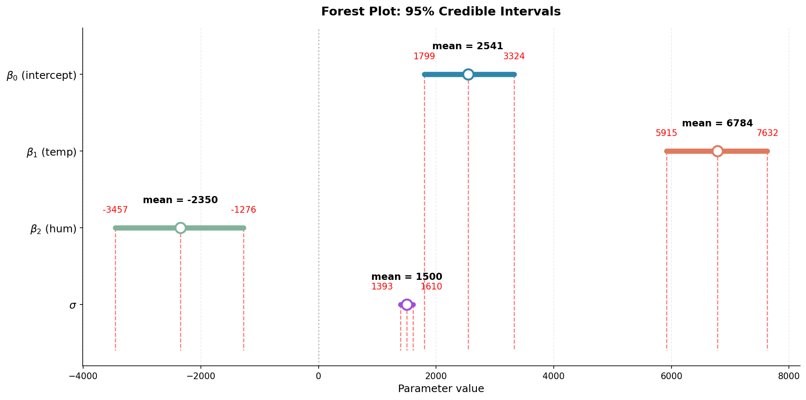
  <br/>
  <em>Forest plot: posterior means with 94% / 50% credible intervals.</em>
</div>

### What the coefficients mean (on the physical scale)

- **Temperature** is the dominant driver. The full normalised range $[0,1]$ corresponds to a 47 °C swing across the dataset; the posterior implies this swing raises expected daily rentals by roughly **+6800**.
- **Humidity** credibly suppresses demand: a unit increase in normalised humidity (perfectly dry → saturated) is associated with **~2350 fewer** rentals on average.
- The intercept $\beta_0 \approx 2541$ corresponds to a corner of predictor space (near-freezing, perfectly arid) that is not physically attainable.
- $\sigma \approx 1500$ corresponds to a 34% coefficient of variation relative to the mean of `cnt` — calendar effects, holidays, and other weather covariates we deliberately omit account for the rest.

---

## Convergence diagnostics

<div align="center">
  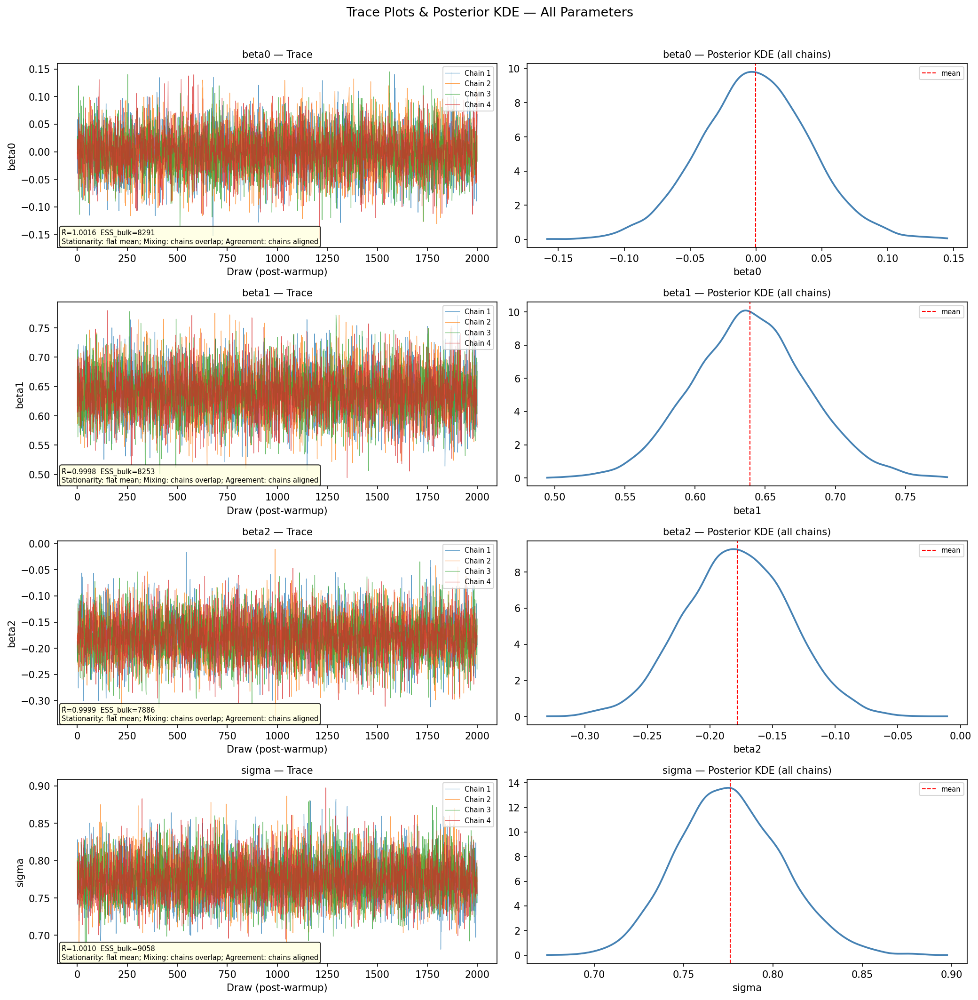
  <br/>
  <em>Trace plots (left) and posterior KDEs (right). All four chains exhibit the canonical "hairy caterpillar" pattern with no drift and substantial overlap.</em>
</div>

<div align="center">
  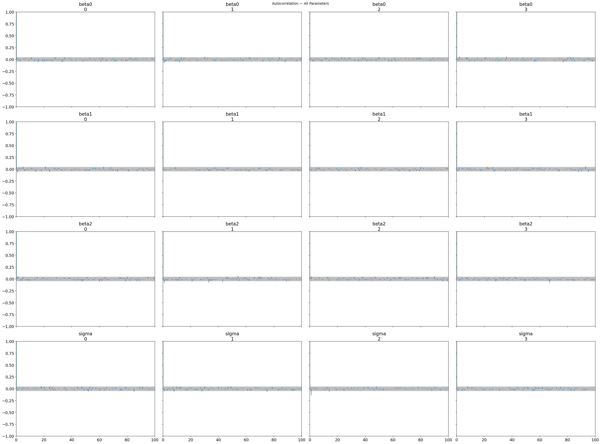
  <br/>
  <em>Autocorrelation decays to zero within 5–10 lags, consistent with efficient NUTS sampling.</em>
</div>

| Diagnostic | Result |
|---|---|
| $\hat R$ | $\le 1.002$ across all parameters (threshold 1.01) |
| ESS<sub>bulk</sub> | 3 775 – 5 371 (rule-of-thumb minimum: 400) |
| Divergent transitions | 0 / 8000 |
| Burn-in | 1000 warm-up steps discarded (chains stationary within 100–200 post-warm-up draws) |

---

## Frequentist comparison

OLS recovers **substantively identical** central tendencies and intervals — exactly what one expects from precision-additivity under a near-uninformative prior:

<div align="center">

| Parameter | OLS point | Bayes mean | OLS 95% CI | Bayes 95% HDI |
|:---:|---:|---:|---|---|
| $\beta_0$ | 2547.58 | 2541.46 | [1801.30, 3293.87] | [1799.45, 3323.63] |
| $\beta_1$ | 6795.86 | 6783.75 | [5931.57, 7660.15] | [5914.93, 7632.40] |
| $\beta_2$ | −2370.23 | −2350.28 | [−3452.04, −1288.42] | [−3457.29, −1276.42] |
| $\sigma$ | 1497.40 | 1500.30 | — | [1393, 1610] |

</div>

Numerical convergence ≠ epistemological equivalence. The frequentist 95% interval is a long-run frequency property of the *construction procedure*; the Bayesian HDI is a probability statement about *the parameter*. The agreement here is a deliberate consequence of weakly informative priors — Section 5's stress test ([Prior C](#sensitivity-to-prior-specification)) breaks it cleanly.

---

## Sensitivity to prior specification

We compare three priors:

| | $\beta_j$ | $\sigma$ |
|---|---|---|
| **Prior A** (baseline, weakly informative) | $\mathcal{N}(0, 10000^2)$ | Half-Normal(3000) |
| **Prior B** (10× more diffuse) | $\mathcal{N}(0, 100000^2)$ | Half-Normal(30000) |
| **Prior C** (10× narrower stress test) | $\mathcal{N}(0, 1000^2)$ | Half-Normal(300) |

<div align="center">
  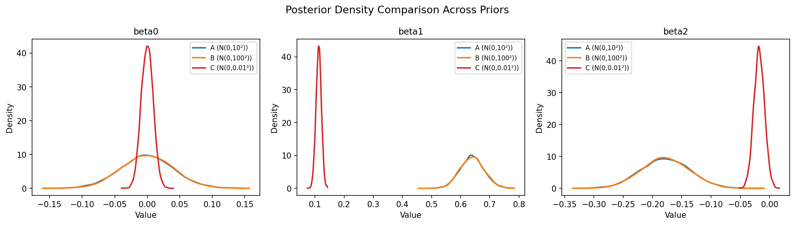
  <br/>
  <em>Overlaid posterior densities under Priors A (blue), B (orange), C (red). A and B are visually indistinguishable; C collapses every coefficient toward zero.</em>
</div>

Standardised shift $\Delta / \mathrm{SD}_\text{post}$ between A and B is at most $0.05$ — a textbook diagnostic of a **data-dominated posterior**. Under the narrow Prior C, $\hat\beta_1$ shifts by 2.17 SDs and $\hat\beta_2$ by 1.78 SDs, confirming that an aggressive prior *can* dominate, and so the agreement with OLS in Section 3.2 is real but not automatic.

---

## Extension: Sequential Bayesian updating

We split the 360 ordered observations into four chronological blocks of 90 (one per half-year over 2011–2012). Within each block, the posterior is summarised by independent marginals — Normal for each $\beta_j$, Half-Normal for $\sigma$ — and these are passed forward as the next block's prior via moment matching:

$$
\beta_j \mid \text{Block }k+1 \sim \mathcal{N}\!\left(\mu_k^{(j)},\, (s_k^{(j)})^2\right), \qquad
\sigma \mid \text{Block }k+1 \sim \mathrm{Half\text{-}Normal}\!\left(\frac{\mu_k^{(\sigma)}}{\sqrt{2/\pi}}\right)
$$

<div align="center">
  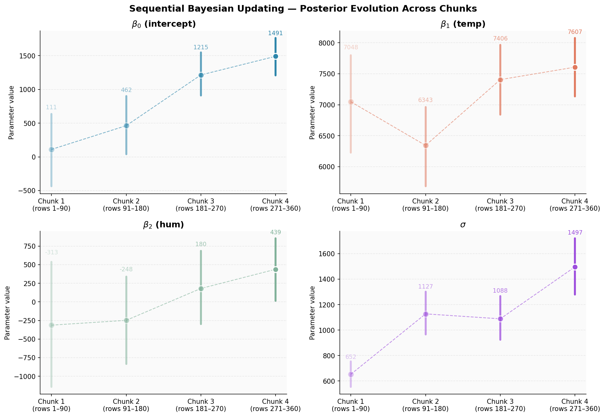
  <br/>
  <em>Posterior means and 95% credible intervals across the four blocks. Darker = later block. Both β₀ and β₁ contract progressively; β₂ shifts sign across the seasonal cycle.</em>
</div>

<div align="center">
  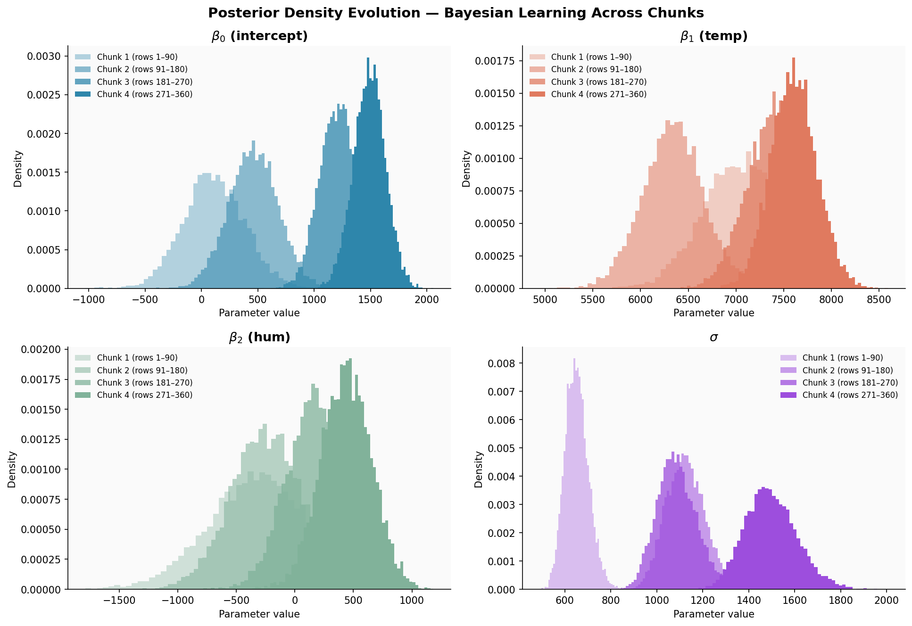
  <br/>
  <em>Posterior density evolution across blocks 1 → 4. The temperature posterior tightens around a stable centre. The humidity posterior visibly migrates from negative to positive — a real seasonal phenomenon, not a numerical artefact.</em>
</div>

### What sequential updating reveals

- **Temperature** ($\beta_1$) — textbook Bayesian learning. SD shrinks by 40% across blocks; the posterior mean stays strictly positive throughout.
- **Humidity** ($\beta_2$) — sign reversal across the seasonal cycle. In spring/summer blocks, humidity correlates positively with temperature, and the partial effect of humidity flips locally. The full-sample posterior averages this out into a net negative effect.
- **Residual scale $\sigma$** rises monotonically from 652 (winter, low demand) to 1503 (summer, high demand), empirically confirming the Breusch–Pagan rejection of homoscedasticity (p < $10^{-3}$) and pointing to a future heteroscedastic extension.

A clean illustration that **moment-matched sequential updating recovers strong signals but degrades on weak ones**, since the moment-matched independent-marginal prior discards posterior correlation among $(\beta_1, \beta_2, \sigma)$ that the joint posterior carries.

---

## Reproducing the analysis

```bash
python -m venv .venv
source .venv/bin/activate
pip install -r requirements.txt

# 1. Download the UCI dataset (auto-skips if already present)
python -m src.download_data

# 2. Subsample to n = 360 with seed 42, sorted by date
python -m src.data_prep

# 3. Exploratory plots and summary statistics
python -m src.eda

# 4. OLS baseline
python -m src.frequentist_baseline

# 5. Tests
pytest tests/
```

The full Bayesian pipeline (NUTS sampling, diagnostics, sensitivity, sequential updating) lives on the sibling branches `module-B`, `module-c`, and `Module-D`. Each branch is self-contained for its module.

### Cross-module data contracts

**`day_subsampled.csv`** — column order is fixed: `dteday, cnt, temp, hum, season, yr, mnth, holiday, weekday, workingday, weathersit, atemp, windspeed, casual, registered, instant`. Rows sorted chronologically. Sequential updating slices `df.iloc[i*90:(i+1)*90]`.

**`frequentist_results.csv`** — schema `parameter, mle, std_err, ci_lower, ci_upper, p_value`, with `parameter ∈ {beta_0, beta_1_temp, beta_2_hum, sigma}`. Module B's `posterior_table.csv` mirrors these names for direct merging.

**Random seed** — every module uses `random_state=42` / `np.random.seed(42)`.

---

## Repository layout

```
bayes_bike_project/
├── data/
│   ├── day.csv                       # Raw UCI data (auto-downloaded)
│   └── day_subsampled.csv            # n = 360, seed = 42
├── src/
│   ├── config.py                     # Paths, contracts, logging
│   ├── data_prep.py                  # Load, validate, subsample
│   ├── download_data.py              # UCI dataset fetch with fallback URL
│   ├── eda.py                        # Summary stats + plots
│   └── frequentist_baseline.py       # OLS reference fit
├── results/
│   ├── figures/                      # All plots used in this README
│   ├── eda_summary_stats.csv
│   ├── frequentist_results.csv
│   ├── frequentist_diagnostics.csv
│   └── overdispersion_check.txt
├── report/                           # LaTeX sources for §1, §2.1, §3.2
├── tests/                            # pytest unit tests
├── requirements.txt
└── README.md
```

---

## Team

| Member | Responsibilities |
|---|---|
| **Yuelin Wu** | §1 Introduction & dataset · §2.1 Likelihood justification · §3.2 Frequentist comparison |
| **Bowen Jiang** | §2.2 Prior specification · §3.1 Bayesian posterior summaries |
| **Zhe Han** | §4 Sampler behaviour · §5 Prior sensitivity |
| **Keming Chen** | §6 Sequential updating extension · §7 Conclusions · Integration |
| **Letian Xu** | Dataset selection · Cross-section support |

QHM6703 Bayesian Statistics, Queen Mary University of London. Hainan, May 2026.

---

## References

1. Fanaee-T, H. & Gama, J. (2014). [Event labeling combining ensemble detectors and background knowledge](https://doi.org/10.1007/s13748-013-0040-3). *Progress in Artificial Intelligence*, 2(2–3), 113–127.
2. Gelman, A., Carlin, J. B., Stern, H. S., Dunson, D. B., Vehtari, A. & Rubin, D. B. (2013). *Bayesian Data Analysis* (3rd ed.). Chapman & Hall/CRC.
3. Gelman, A. & Rubin, D. B. (1992). Inference from iterative simulation using multiple sequences. *Statistical Science*, 7(4), 457–472.
4. Hoffman, M. D. & Gelman, A. (2014). [The No-U-Turn Sampler](https://jmlr.org/papers/v15/hoffman14a.html). *JMLR*, 15(47), 1593–1623.
5. Vehtari, A., Gelman, A., Simpson, D., Carpenter, B. & Bürkner, P.-C. (2021). [Rank-normalization, folding, and localization: An improved $\hat R$ for assessing convergence of MCMC](https://doi.org/10.1214/20-BA1221). *Bayesian Analysis*, 16(2), 667–718.
6. Abril-Pla, O. *et al.* (2023). [PyMC: a modern, comprehensive probabilistic programming framework in Python](https://doi.org/10.7717/peerj-cs.1516). *PeerJ Computer Science*, 9, e1516.
